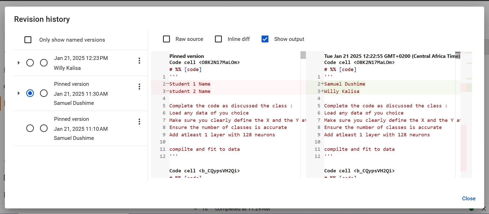

# MNIST Neural Network Model

This project demonstrates the creation, training, and evaluation of a neural network using TensorFlow and the MNIST dataset. The MNIST dataset is a collection of 28x28 grayscale images of handwritten digits (0-9) with corresponding labels.

## Features
- Loading and preprocessing the MNIST dataset.
- Building a neural network with:
  - An input layer.
  - Two hidden layers (128 and 64 neurons, respectively).
  - An output layer with 10 neurons (one for each digit class).
- Training the model using the Adam optimizer and categorical cross-entropy loss.
- Evaluating the model's performance on a test dataset.
- Visualizing the training and validation accuracy/loss.
- Saving and loading the trained model.
- Making predictions on test data.

## Files
- `mnist_model.ipynb`: The main notebook containing the code for loading data, building, training, and evaluating the neural network.
- `mnist_model.h5`: The saved trained model file.

## Requirements
The project requires the following Python libraries:
- TensorFlow
- NumPy
- Matplotlib
- Pandas

To install the required libraries, run:
```bash
pip install tensorflow numpy matplotlib pandas
```

## Usage
1. Clone this repository to your local machine.
2. Open the `mnist_model.ipynb` notebook in Jupyter Notebook or any compatible editor.
3. Run all cells in the notebook to:
   - Load and preprocess the MNIST dataset.
   - Build and train the model.
   - Save and load the model.
   - Evaluate and visualize the model's performance.

## Model Architecture
- **Input Layer:** Flattened input of size 784 (28x28).
- **Hidden Layer 1:** Dense layer with 128 neurons and ReLU activation.
- **Hidden Layer 2:** Dense layer with 64 neurons and ReLU activation.
- **Output Layer:** Dense layer with 10 neurons and Softmax activation.

## Results
The model achieves a high accuracy on the MNIST test dataset, showcasing its ability to classify handwritten digits effectively. Detailed training and validation metrics are visualized in the notebook.

## Visualization
The notebook includes plots for:
- Training and validation accuracy over epochs.
- Training and validation loss over epochs.

## License
This project is open-source and available under the MIT License.

## Author
Developed by Samuel Dushime and Willy Kalisa

##  Commits



For any questions or suggestions, please feel free to reach out!


